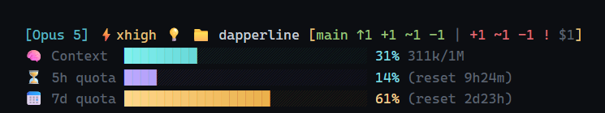

# dapperline

[English](README.md) · **한국어**

[Claude Code](https://code.claude.com)용 [posh-git](https://github.com/dahlbyk/posh-git) 스타일 상태줄. PowerShell 사용자에게 익숙한 그 git 상태 포맷에, 컨텍스트 창과 사용량 한도를 얹었습니다.



- **진짜 posh-git 포맷** — 원격 추적 화살표, staged `|` unstaged 개수, 충돌, stash까지. 브랜치 이름만 보여주지 않습니다.
- **줄마다 고유 색과 아이콘**을 써서 바가 세로로 쌓여도 뭉개지지 않습니다. 위험도는 퍼센트 숫자가 맡고, 위험 구간에서는 바도 빨강으로 넘어갑니다.
- **렌더링당 git 프로세스 1개.** 대부분의 상태줄은 5~6개를 띄웁니다.
- **환경에 맞춰 자동 강등** — 24비트 / 256색 / 16색 / `NO_COLOR` / ASCII 전용 모드를 알아서 고릅니다.
- **색각 보조 팔레트가 기본** — 청록 → 노랑 → 빨강으로, 색상뿐 아니라 명도로도 구분됩니다.
- 단일 파일, 의존성 없음. Node.js라 macOS·Linux·Windows에서 동일하게 동작합니다.

## 설치

Node.js 18 이상과 git이 필요합니다.

**macOS / Linux**

```bash
curl -fsSL https://raw.githubusercontent.com/dev-2nan/dapperline/main/install.sh | bash
```

**Windows (PowerShell)**

```powershell
irm https://raw.githubusercontent.com/dev-2nan/dapperline/main/install.ps1 | iex
```

설치 스크립트가 `~/.dapperline`에 클론하고, `~/.claude/settings.json`에 `statusLine`을 추가한 뒤(파일은 먼저 백업하고 다른 키는 건드리지 않습니다), 한 번 렌더링해서 실제로 동작하는지까지 확인합니다. 다시 실행하면 그 자리에서 업데이트됩니다. 다른 위치에 넣으려면 `DAPPERLINE_DIR`을 지정하세요.

<details>
<summary>직접 설치하기</summary>

```bash
git clone https://github.com/dev-2nan/dapperline.git ~/.dapperline
```

`~/.claude/settings.json`에 이걸 추가합니다.

```json
{
  "statusLine": {
    "type": "command",
    "command": "node ~/.dapperline/dapperline.js",
    "refreshInterval": 10
  }
}
```

이미 클론한 디렉토리에서 `install.sh`를 실행하면 새로 클론하지 않고 **그 클론을 그대로** 연결합니다.

`refreshInterval`은 선택이 아니라 넣는 게 좋습니다 — [쿼타 줄이 늦게 나타나는 이유](#쿼타-줄이-늦게-나타나는-이유) 참고.
</details>

<details>
<summary>Windows</summary>

경로는 **반드시 슬래시(`/`)** 로 쓰세요. Git Bash가 설치되어 있으면 Claude Code가 상태줄을 Git Bash로 실행하는데, Git Bash는 백슬래시를 이스케이프 문자로 먹어버립니다. 그러면 **오류 없이 조용히 실패해서 상태줄이 빈 채로 남습니다.**

```json
{
  "statusLine": {
    "type": "command",
    "command": "node C:/Users/you/.dapperline/dapperline.js"
  }
}
```
</details>

상태줄은 다음 갱신 시점에 나타납니다 — 어시스턴트 메시지 도착, `/compact` 완료, 권한 모드 변경 등입니다. 안 보이면 Claude Code를 재시작하세요.

## 읽는 법

### 헤더

```
[Opus 5] ⚡xhigh 💡 🚀 📁 dapperline
   │        │     │  └─ fast mode 켜짐
   │        │     └─ 확장 사고 켜짐
   │        └─ 추론 강도
   └─ 모델
```

### git 구역

```
[main ↑1 +1 ~1 -1 | +1 ~1 -1 !2 ! $3]
 │     │  └ staged ┘  └unstaged┘ │  │  └ stash
 │     │                         │  └ 작업 트리 상태
 │     └ 원격 대비                └ 충돌
 └ 브랜치
```

| 기호 | 의미 |
|---|---|
| `≡` | 원격과 동일 |
| `↑n` `↓n` `↑n↓m` | 앞섬 / 뒤짐 / 갈라짐 |
| `×` | upstream이 사라짐 |
| `➦ 87a31fc` | detached HEAD |
| `+` `~` `-` | 신규 / 수정 / 삭제 |
| `!n` | 충돌 파일 수 |
| `!` `~` | 맨 뒤: 표시된 카운트가 작업 트리(`!`)인지 staged(`~`)인지 |
| `$n` | stash 개수 |

`|` 왼쪽이 **staged(초록)**, 오른쪽이 **작업 트리(빨강)** 입니다. untracked 파일은 작업 트리의 신규(`+`)로 잡힙니다.

변화가 없는 쪽은 통째로 사라집니다. 그래서 대부분의 상황에서 구역이 짧게 유지됩니다.

| 상태 | 표시 |
|---|---|
| 깨끗 | `[main ≡]` |
| staged만 | `[main ≡ +0 ~1 -0 ~]` |
| 작업 트리만 | `[main ≡ +0 ~1 -0 !]` |
| 둘 다 | `[main ≡ +1 ~0 -0 \| +0 ~1 -0 !]` |

맨 뒤 기호가 posh-git의 작업 디렉토리 상태입니다. `!`는 지금 보이는 카운트가 **작업 트리**의 것, `~`는 **staged**의 것이라는 뜻입니다. 한쪽만 표시될 때 색에 의존하지 않고 구분되게 해주며, 양쪽이 다 더러우면 작업 트리가 우선합니다.

posh-git 원형대로 양쪽을 항상 보고 싶으면 `showZeros: 'always'`로 두세요.

브랜치 이름 색이 원격과의 관계를 나타냅니다 — 청록은 동일, 초록은 앞섬, 빨강은 뒤짐, 노랑은 갈라짐, 회색은 upstream 없음.

git 저장소가 아닌 곳에서는 대괄호 구역이 통째로 사라집니다.

### 사용량 구역

지표마다 자기 바 한 줄을 갖습니다(맨 위 배너 참고). 앞에 아이콘과 이름이 붙어서 색이 같아도 줄이 구분됩니다.

| 줄 | 무엇을 재는가 | 뒤에 붙는 값 |
|---|---|---|
| 🧠 `Context` | 이 대화의 컨텍스트 창 | 쓴 토큰 / 전체, `311k/1M` |
| ⏳ `5h quota` | 계정의 5시간 사용량 한도 | 리셋까지 남은 시간, `(reset 9h24m)` |
| 📅 `7d quota` | 계정의 7일 사용량 한도 | 리셋까지 남은 시간, `(reset 2d23h)` |

라벨은 **구분되는 단어를 앞에** 둡니다. `Usage 5H`처럼 공통 단어가 앞에 오면 세로로 쌓였을 때 눈이 두 번 읽어야 하지만, `5h quota`는 왼쪽 가장자리만 훑어도 구분됩니다.

각 줄의 바는 고유 색조(청록·보라·호박)를 갖고 채워질수록 연한색에서 진한색으로 갑니다. 그래서 세 줄이 같은 임계값 구간에 있어도 서로 구별됩니다. **위험도는 퍼센트 숫자가** 표현하고, 값이 danger 구간에 들어가면 바 전체가 빨강으로 넘어갑니다 — 그 시점에는 구분보다 경고가 중요하기 때문입니다.

컨텍스트 바는 70/90%, 쿼타 바는 50/80%가 경계입니다. 그래서 같은 비율이 채워져 있어도 줄마다 색이 다를 수 있는데, 이건 임계값이 제 역할을 하는 것이지 불일치가 아닙니다.

사용량 한도는 Claude.ai Pro/Max 구독자에게 첫 API 응답 이후에 나타납니다. 값이 없으면 쿼타 줄이 사라지고 컨텍스트 바도 라벨을 떼면서 한 줄로 접힙니다. Claude Code가 나중에 다른 한도 창을 보내기 시작하면 자동으로 줄이 하나 더 생기고 라벨 정렬도 다시 맞춰집니다.

한 줄로 압축하려면 `rateLayout: 'inline'` 으로 바꾸세요. 쿼타가 자기 줄을 갖는 대신 컨텍스트 바 뒤에 `| 5h 14% | 7d 61%` 형태로 붙습니다.

### 바가 채워지는 단위

기본 폭 30칸에서 **한 칸은 3.33%** 입니다. 퍼센트가 정수로 내려가기 때문에 실제로는 3%p 또는 4%p마다 한 칸씩 찹니다(4, 3, 3 반복). 10%마다 정확히 3칸이라 임계값이 칸 경계에 딱 떨어집니다 — 컨텍스트 70%는 21칸째, 90%는 27칸째, 쿼타 50%는 15칸째, 80%는 24칸째입니다.

`barWidth`를 20(5%), 25(4%), 50(2%)으로 바꾸면 간격이 균등해지지만, 대신 임계값이 칸 중간에 걸릴 수 있습니다.

### 바 글자

`█`과 `░`는 유니코드 블록에서 서로 다른 계열이라, **폰트에 따라 세로 위치가 어긋나 보입니다** — 안 채워진 부분이 위로 떠 보이는 현상입니다. **GitHub의 고정폭 폰트가 정확히 이 문제를 갖고 있습니다.** 맨 위 배너를 스크린샷으로 넣은 이유가 그것이고, 아래쪽 텍스트 예시는 여기서 어긋나 보일 수 있습니다. 터미널에서는 정상입니다. 쓰시는 터미널 폰트에서도 같은 문제가 있다면 `barStyle`을 바꾸세요.

| 스타일 | 글자 | 설명 |
|---|---|---|
| `solid` | `█` `█` | 같은 글자만 쓰고 밝기로 구분. 어긋날 수가 없음. 24비트 색 필요 |
| `line` | `━` `─` | 둘 다 세로 중심이 같은 선 문자. 모든 색상 모드에서 동작 |
| `block` | `█` `░` | 기존 방식. 위 현상이 생기는 조합 |

기본값은 `block`입니다. `auto`는 트루컬러면 `solid`, 아니면 `block`을 고르는 별칭으로 남겨뒀습니다.

### `barColor: 'threshold'`

다른 방식도 있습니다. 각 칸을 **그 칸이 대표하는 퍼센트**로 칠해서, 임계값 위치가 바 위의 색 변화로 보이게 하는 모드입니다.

```
칸:      1    2    3    4    5    6    7    8    9   10
담당:   5%  15%  25%  35%  45%  55%  65%  75%  85%  95%
구간:  ├────────── ok ──────────┤├─ warn ─┤├ danger ┤
                             70% ↑     90% ↑
```

바가 하나일 때는 잘 읽히지만, 여러 줄이 쌓이면 같은 구간의 줄끼리 같은 색이 되어 구분이 어렵습니다. 그래서 `'identity'`가 기본값입니다. 어느 모드든 빈 칸은 흐리게 칠해지고, 24비트 색이 없는 환경에서는 바 전체가 단색으로 폴백합니다.

## 설정

모든 설정은 `dapperline.js` 맨 위 `CONFIG` 블록에 있습니다.

| 옵션 | 기본값 | 설명 |
|---|---|---|
| `showZeros` | `'section'` | `'section'`은 변화 없는 쪽을 통째로 숨기고, 변화 있는 쪽은 세 항목을 다 표시. 깨끗하면 브랜치만 남음. `'always'`는 posh-git 원형으로 양쪽 항상 표시. `'never'`는 0을 전부 생략 |
| `showStash` | `true` | `$n` stash 개수 |
| `shortenModel` | `true` | 모델명 끝 괄호 제거: `Opus 5 (1M context)` → `Opus 5` |
| `showEffort` | `true` | `⚡xhigh` 추론 강도 |
| `showThinking` | `true` | 확장 사고가 켜져 있으면 `💡` |
| `showFastMode` | `true` | fast mode가 켜져 있으면 `🚀` |
| `barWidth` | `30` | 바 한 줄의 칸 수 |
| `barStyle` | `'block'` | 바 글자. `'block'`은 █/░, `'line'`은 ━/─, `'solid'`는 전부 █에 밝기로만 구분. `'auto'`는 트루컬러면 solid, 아니면 block |
| `showTokens` | `true` | 컨텍스트 퍼센트 옆에 토큰 수 |
| `rateLayout` | `'lines'` | 쿼타마다 바 한 줄. `'inline'`이면 컨텍스트 줄 뒤에 붙임 |
| `rowIcons` | `true` | 줄 앞에 🧠/⏳/📅 |
| `rowLabels` | `true` | 줄 이름 표기: `Context`, `5h quota`, `7d quota` |
| `barColor` | `'identity'` | 줄별 고유색, danger에서 빨강. `'threshold'`면 구간별 색 |
| `showReset` | `true` | 각 한도 창이 초기화되기까지 남은 시간 `(reset 9h24m)` |
| `showCost` | `false` | 세션 누적 비용(USD) |
| `showDuration` | `false` | 세션 경과 시간 |
| `palette` | `'daltonized'` | `'classic'`이면 통상의 초록 → 노랑 → 빨강 |
| `color` | `'auto'` | `'truecolor'`, `'256'`, `'16'`, `'none'`으로 강제 지정 가능 |
| `glyphs` | `'auto'` | `'unicode'` 또는 `'ascii'`로 강제 지정 가능 |
| `limits` | 아래 참조 | 경고/위험 임계값 |

```js
limits: {
  context: { warn: 70, danger: 90 },  // %
  rate:    { warn: 50, danger: 80 },  // %
  cost:    { warn: 5,  danger: 20 },  // USD
  time:    { warn: 60, danger: 180 }, // 분
}
```

`debugDump`에 파일 경로를 넣으면 Claude Code가 보내는 JSON 원본이 그 파일에 기록됩니다. 실제로 어떤 필드가 오는지 확인하는 가장 빠른 방법입니다.

## 터미널 지원

`color: 'auto'`는 이 순서로 판단합니다.

| 신호 | 결과 |
|---|---|
| `NO_COLOR`가 설정됨 | `none` |
| `COLORTERM=truecolor` 또는 `24bit` | `truecolor` |
| `WT_SESSION` (Windows Terminal) | `truecolor` |
| `TERM_PROGRAM`이 iTerm2, WezTerm, VS Code, Hyper, ghostty | `truecolor` |
| `TERM`이 `-256color`로 끝남 | `256` |
| `TERM=dumb` | `none` |
| 그 외 | `16` |

**macOS 기본 Terminal.app은 24비트 색을 지원하지 않습니다.** `xterm-256color`로 보고하기 때문에 그라데이션 대신 단색 바로 떨어집니다. 그라데이션을 보려면 iTerm2나 WezTerm을 쓰세요. Windows Terminal은 `COLORTERM`을 설정하지 않아서 `WT_SESSION`으로 따로 잡습니다.

`glyphs: 'auto'`는 `TERM=dumb`과 리눅스 콘솔을 제외하면 유니코드를 씁니다. ASCII 모드에서는 블록과 화살표가 `#`, `.`, `=`, `^`, `v`로 바뀌고 이모지가 빠집니다 — 이모지 폭이 터미널마다 달라 줄이 어긋날 때 유용합니다.

## 다른 PC에 설치하기

[설치](#설치)의 한 줄짜리 명령을 그대로 실행하면 됩니다. 스크립트가 써넣는 경로는 `~`를 쓰기 때문에 **settings.json 내용이 모든 머신에서 동일**합니다. 업데이트는 이렇게 합니다.

```bash
cd ~/.dapperline && git pull
```

설정은 다시 건드릴 필요 없습니다. 설치 스크립트를 다시 실행해도 되는데, 그러면 pull과 재연결을 한 번에 합니다.

## 쿼타 줄이 늦게 나타나는 이유

새 세션을 열면 컨텍스트 바만 보이고 5h·7d 줄은 잠시 뒤에 나타납니다. 원인이 둘인데 어느 쪽도 버그가 아닙니다.

`rate_limits`는 **세션의 첫 API 응답 전까지 페이로드에 아예 없습니다.** 그릴 데이터 자체가 없는 거죠. 게다가 statusline은 정해진 이벤트에만 다시 실행됩니다 — 어시스턴트 메시지 도착, `/compact`, 권한 모드 변경, vim 모드 전환. **데이터가 도착했다는 이유만으로는 재실행되지 않습니다.** 그래서 우연히 그 이벤트를 건드릴 때까지 옛날 화면이 그대로 남습니다.

`refreshInterval: 10`이 둘 다 해결합니다. 쿼타 줄이 10초 안에 채워지고, `(reset ...)` 카운트다운도 마지막 렌더링 시점에 멈춰 있지 않고 계속 갱신됩니다. 렌더링 1회가 git 프로세스 하나와 Node 부팅으로 약 200ms라, 10초 간격은 부담이 되지 않습니다.

쿼타 줄이 없는 동안에는 컨텍스트 바가 아이콘과 라벨을 떼고 한 줄로 접힙니다 — 줄이 하나뿐이면 맞출 상대가 없어서입니다.

## 테스트

```bash
npm test              # ANSI 제거
node test/render.js   # 색상 포함
```

지금 쓰는 버전을 확인하려면:

```bash
node ~/.dapperline/dapperline.js --version
# dapperline 0.2.0 (4505f45)
```

커밋 해시를 같이 찍는 이유는, 설치가 `main`을 따라가기 때문에 태그만으로는 그 뒤로 몇 커밋 더 갔는지 알 수 없어서입니다.

임계값 구간별, 필드 누락, 비정상적인 컨텍스트 크기에 대한 픽스처를 렌더링한 뒤, 다섯 가지 터미널 환경을 흉내내어 색상·글리프 폴백을 확인합니다.

## 구현 메모

`used_percentage`는 입력 토큰만으로 계산되기 때문에, 토큰 카운터도 `total_input_tokens`를 씁니다. 그래야 옆에 붙은 퍼센트와 숫자가 서로 맞습니다.

stash 개수는 `git stash list`를 띄우는 대신 `logs/refs/stash` 파일을 직접 읽어서 셉니다. 덕분에 렌더링당 git 프로세스가 하나로 유지됩니다.

stdin은 `setEncoding('utf8')`로 읽습니다. 멀티바이트 문자가 청크 경계에 걸려도 깨지지 않으며, 한글 디렉토리 이름 같은 경우가 여기에 해당합니다.

## 참고한 프로젝트

git 포맷은 Keith Dahlby의 [posh-git](https://github.com/dahlbyk/posh-git)입니다. 세션 텔레메트리와 추론 강도를 상태줄에 넣는 아이디어는 [CC-statusline](https://github.com/AwesomeJun/CC-statusline)과 [ccstatusline](https://github.com/sirmalloc/ccstatusline)에서 가져왔습니다.

## 라이선스

MIT
